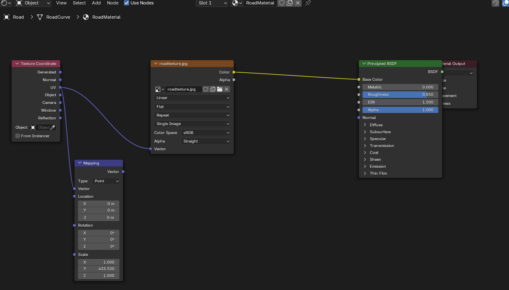

# Road 메시에 texture 추가 (수동)

## 0. 기본 매핑 (road_generator.py)
현재의 road_generator.py 코드는 이 상태까지만 처리해줌. 
여기서부터 직접 텍스쳐 매핑을 시도하였음.

## 1. shading 에서 Mapping 노드 사용 안함
왜그런지는 모르겠지만 매핑 꺼야 제대로 됨

## 2. 아무 부분이나 확대
각 사각형들이 보일때까지 확대함.

follow active quads 를 적용할 10개의 사각형을 정하기 위함. (사진 상 빨간색 그림 내부)

## 3. 세로줄 x 축 정렬
각 세로줄 선택 후 키보드 s -> x -> 0 (숫자)
세로줄을 x 축에 정렬함.

11개의 세로줄을 한번에 선택하고 진행하면 모든 세로줄들이 하나로 합쳐짐. 따라서 각각 세로줄에 대해서 하나하나 작업해야함.

결과 : 

## 4. 가로줄 y 축 정렬
세로줄과 달리, 10개의 사각형들을 하나로 보고, 윗변, 아래변끼지 붙어있는 가로줄들은 한번에 작업가능

위쪽 변의 10개 가로줄 동시 선택 -> 키보드 s -> y -> 0 (숫자)

아래쪽 변 10개도 동일하게 진행

## 5. 정렬된 직사각형들로 follow active quads 실행

정렬이 끝났으니, 10개의 직사각형들을 선택하고, 왼쪽의 uv edit 창 말고 오른쪽의 layout 창? 화면에 커서를 위치하고 키보드 u 키 -> follow active quads

옵션은 Even 선택

추가적으로, 잘 모르지만 왼쪽의 uv edit 화면에 10개의 직사각형 중에 흰색? 회색으로 선택된 직사각형이 있어야하는듯? 무슨 개념인지는 잘 모르겠음. 그렇지 않고 드래그로 10개의 직사각형 선택하고 follow active quads 하면 대각선 방향으로 펴지는 경우가 존재했음.

## 6. follow active quads 결과

아래 두 이미지들을 보면, 선택된 active quads 가 follow active quads 진행한 후에 위치가 서로 다르다. 
저 도로 메시를 20개의 직사각형이 매우 길게 반복된 구조 라고 했을때, 이후 작업에서 몇번째 줄에 차선 메시가 들어가야 하는지를 알 수 있다. 
잘못된 줄에 차선 메시를 넣을 경우 텍스쳐가 이상하게 보일 수 있다.

## 7. 스케일, 위치 조정
결과 이미지를 보면서, 텍스쳐가 제대로 입혀지도록 조정한다.

## 8. 최종 결과 이미지

가로 10, 세로 3 총 30개의 직사각형에 도로 이미지가 들어갔을때 최적의 결과가 나오는걸 확인하였다.

잘못된 줄에 차선 메시 넣을 경우 (6. 번 참고)

